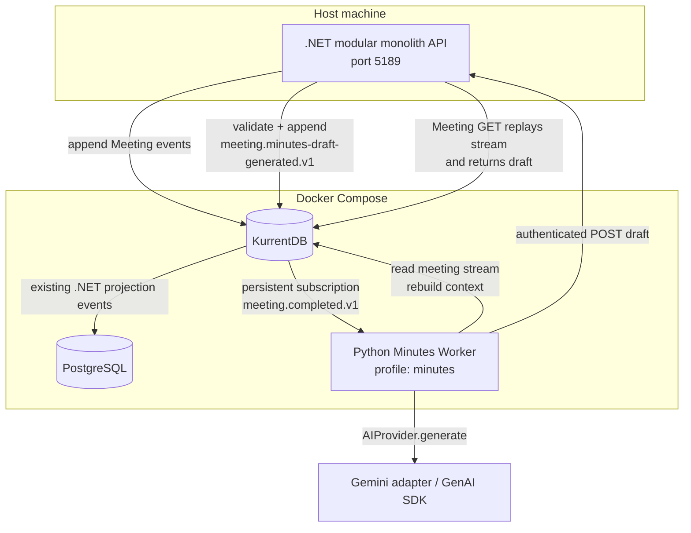
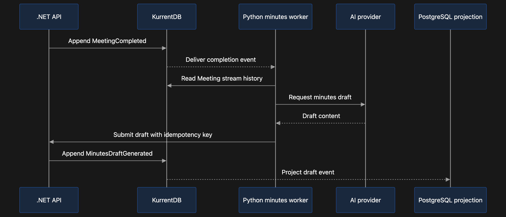
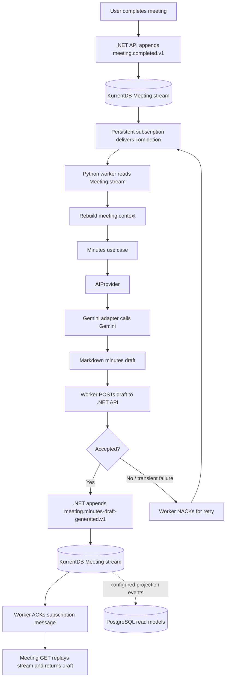

# ADR-0005: Run Minutes Generation as a Python Worker

## Status

Accepted — Implementation is in place; end-to-end runtime verification is pending.

## Context

DecisionPlanner needs AI-assisted meeting minutes while keeping Meeting event streams authoritative and avoiding a Python dependency on .NET persistence internals. The Python service should be replaceable at the AI-provider boundary, recover work after restarts, and return results through the Meeting module's consistency rules.

The current Meeting event stream records meeting creation/completion, participants, topics, proposals, and discussion entries. Voting is not implemented, so voting outcomes cannot yet be included in generated drafts.

## Decision

### Service and dependency boundaries

- Implement the minutes capability in the Python package under `services/minutes`.
- Use FastAPI for health/operations HTTP endpoints. Run event consumption as a separate worker entry point; the HTTP server and worker are different processes, even though they share the package.
- Use the `dependency-injector` container in `composition` as the composition root.
- Application code depends on the provider-neutral `AIProvider.generate(system_prompt, user_prompt)` contract. Infrastructure supplies `GeminiProvider`, which uses Google's GenAI Python SDK. Provider selection and construction stay in the container.
- Keep KurrentDB and HTTP client adapters in Infrastructure. The application use case receives a meeting context and an `AIProvider`; it does not import Gemini, KurrentDB, FastAPI, or the DI container.

### Event consumption and draft generation

- Trigger generation from `meeting.completed.v1` using the persistent subscription group `minutes-draft-generation-v1` on KurrentDB's global event log, filtered by event type.
- Create the subscription from the end of the event log (`from_end=true`). This avoids automatically sending previously completed meetings to Gemini on first startup. Start the worker before completing meetings. Processing older meetings requires an intentional backfill procedure.
- For each completion event, read that meeting's `meeting-{guid:N}` stream and reconstruct the prompt context from the event history. Preserve topic/proposal association for discussion entries.
- Generate a Markdown draft through `AIProvider`. The prompt asks the model to use only recorded facts and not invent decisions, votes, owners, or deadlines. Voting information remains absent until Voting events are implemented.
- Acknowledge the persistent-subscription message only after .NET accepts the generated draft. On processing or HTTP failure, negatively acknowledge for retry. Delivery is at least once; duplicate handling is required.

KurrentDB persistent subscriptions retain server-side checkpoints and support acknowledgment and negative acknowledgment, which lets the worker resume after interruption while requiring idempotent handling of redelivery. See the [KurrentDB Python persistent subscriptions documentation](https://docs.kurrent.io/clients/python/v1.3/persistent-subscriptions).

### Result ownership and event contract

- Python sends the draft to the authenticated .NET endpoint:
  `POST /api/internal/meetings/{meetingId}/minutes-draft`.
- The request contains `completedEventId`, `content`, and `generatedAt`, with the shared secret in `X-Minutes-Service-Key`.
- The .NET Meeting application verifies that the Meeting exists and is completed, then appends `meeting.minutes-draft-generated.v1` to the same Meeting stream. The event includes the Meeting ID, source completion event ID, draft content, and generation timestamp.
- The .NET API deduplicates submissions by `completedEventId`; a retry for an already recorded result succeeds without appending another draft event.
- Python does not append to Meeting streams and does not write PostgreSQL tables. Meeting GET currently exposes generated drafts by replaying the event stream. The PostgreSQL Meeting projection does not yet project minutes drafts.

### Local deployment

- PostgreSQL and KurrentDB remain the default services started by `docker compose up -d`.
- The Python worker is an opt-in Compose profile: `docker compose --profile minutes up -d --build minutes-worker`.
- In the Compose profile, the worker connects to KurrentDB through the Compose network and calls the .NET API on the host at `http://host.docker.internal:5189`. The .NET API is still run separately on the host.
- Configure `GEMINI_API_KEY` and `MINUTES_SERVICE_API_KEY` through environment variables or an untracked root `.env` file. The .NET API reads the same shared secret as `MinutesService__ApiKey`.
- The local Compose KurrentDB runs in insecure mode for development. Production deployment must use authenticated, encrypted connections and narrowly scoped credentials. Creating the persistent subscription requires the appropriate KurrentDB subscription-management permissions.

## Suggested architecture diagram



`docker compose up -d` starts PostgreSQL and KurrentDB. The minutes worker starts only when the `minutes` profile is selected. The .NET API runs separately on the host in the current local setup.

## Suggested flow

The sequence below shows the normal path for a meeting completed after the worker's persistent subscription has been created. Existing meetings are not picked up automatically on the subscription's first creation; backfill is a separate, deliberate operation.

### Suggested flow image



The PostgreSQL projection step shown in this image is part of the proposed target flow. Minutes draft events are not currently projected to PostgreSQL; the Meeting GET endpoint currently replays the Meeting stream to return the draft.

### Flow overview



The .NET API and the Python worker are separate processes. PostgreSQL and KurrentDB start with the default Compose services; the worker is an opt-in Compose profile. The subscription is created from the end of the global log, so starting the worker does not automatically generate drafts for meetings completed before its first subscription creation.

```mermaid
sequenceDiagram
    autonumber
    actor User
    participant API as .NET API
    participant KDB as KurrentDB
    participant Worker as Python Minutes Worker
    participant App as Minutes Application
    participant AI as AIProvider (Gemini adapter)
    participant Model as Gemini

    User->>API: Complete meeting
    API->>KDB: Append meeting.completed.v1 to meeting stream
    KDB-->>API: Completion event persisted
    API-->>User: Meeting completed

    KDB-->>Worker: Deliver completion via persistent subscription
    Worker->>KDB: Read meeting stream
    KDB-->>Worker: Meeting events and discussion context
    Worker->>App: Generate minutes from reconstructed context
    App->>AI: generate(system_prompt, user_prompt)
    AI->>Model: Generate draft
    Model-->>AI: Markdown draft
    AI-->>App: Draft content
    App-->>Worker: Draft result

    Worker->>API: POST minutes draft + completedEventId
    API->>KDB: Verify completed state; append draft event if not already recorded
    KDB-->>API: Draft event persisted (or duplicate already handled)
    API-->>Worker: Success
    Worker->>KDB: ACK subscription message

    User->>API: GET meeting
    API->>KDB: Replay meeting stream
    KDB-->>API: Meeting state including minutes draft
    API-->>User: Meeting with generated draft

    Note over Worker,KDB: On processing or API failure, NACK for retry. Delivery is at least once; .NET deduplicates by completedEventId.
    Note over KDB: The existing .NET projection independently projects its configured events to PostgreSQL; minutes drafts are not currently projected there.
```

## Consequences

### Positive

- AI provider choice stays outside application use cases.
- The server-managed subscription checkpoint allows the worker to resume processing after restarts.
- .NET remains the owner of Meeting validation, stream concurrency, and appending Meeting events.
- Retried delivery does not create multiple draft events for the same completion event.
- Development can start the databases independently and opt in to the worker only when its secrets and .NET API are ready.

### Trade-offs

- The worker needs KurrentDB subscription-management permission on first startup, in addition to read permission.
- A fresh subscription starts at the end of the log. Historical meetings are not generated automatically and need deliberate backfill.
- KurrentDB, .NET API, Gemini, or network failures delay the draft. Persistent subscription retries can eventually park repeatedly failing messages; operators need a replay procedure.
- Meeting content sent to the configured AI provider leaves the application boundary. Provider/data-handling policy must be appropriate for the meeting data.
- The API shared secret must be configured consistently for both processes and rotated operationally.
- The minutes worker is an additional runtime component to deploy and monitor.
- PostgreSQL does not yet contain a minutes-draft projection; Meeting GET reads the draft from the event stream until a projection/query migration is designed.

## Alternatives considered

### Python appends the result directly to KurrentDB

Rejected. It would grant Python write access to Meeting streams and duplicate .NET aggregate validation and expected-revision handling. Returning the result through .NET keeps Meeting stream ownership in the modular monolith.

### Generate minutes synchronously in the meeting-completion HTTP request

Rejected. AI latency or provider unavailability would extend or fail the user's completion request. The persistent subscription decouples completion from generation and retains pending work.

### Start the persistent subscription at the beginning of the event log

Rejected as the automatic first-start behavior because it would process and transmit all old completed meetings without an explicit backfill decision. A future backfill should be an intentional operational action.
